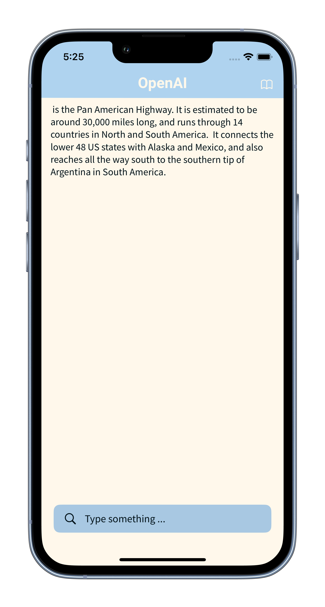
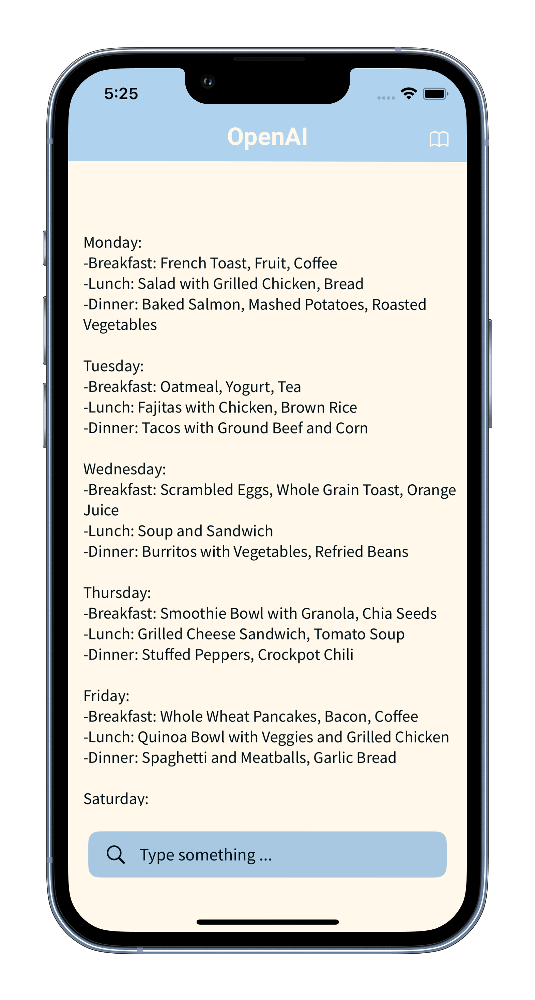
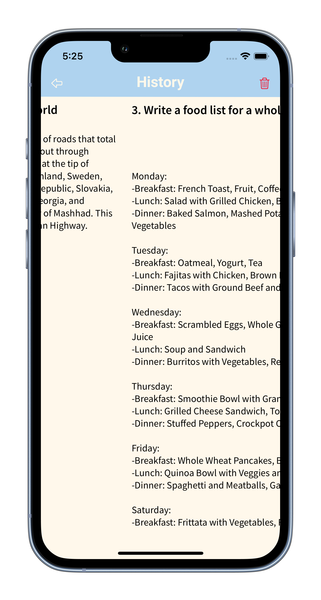
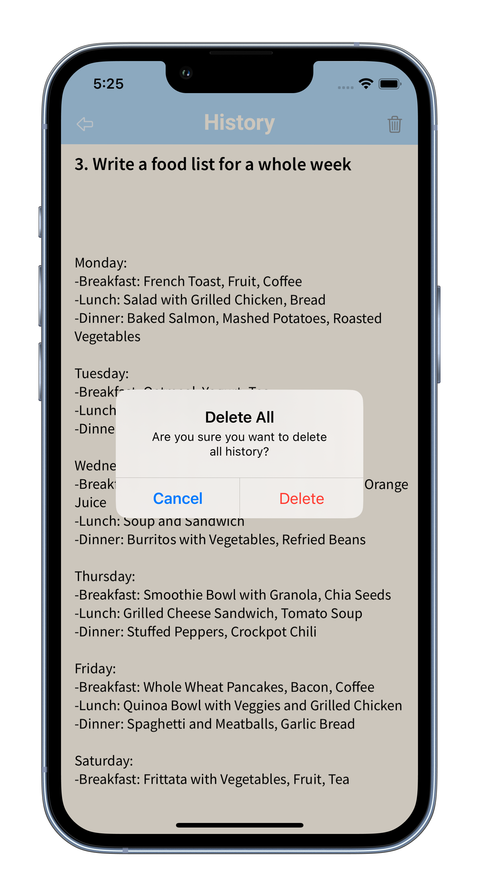

# OpenAI_App

OpenAI a project I made because I am tired of constantly going to the chatgpt website if I need to find out information quickly.

If you want to try this app you should: 
- clone this repository
- have Xcode
- check that all libraries are installed (OpenAISwift, Realm, RealmDatabase, SPIndicator)
- paste your OpenAI token in (OpenAI -> OpenAI_Token -> OpenAIToken.swift -> openAI)

## External Libraries:
- OpenAISwift
- Realm
- SPIndicator

## Compatibility
- iPhone 
- iPad  
Requires iOS 16.0 or later

## Preview

### Onboarding Screen
This is a main screen where the user can search information  

  
  
  

### History Screen
All search history is stored in a database (Realm)

  
  

The user can delete the entire history

  

